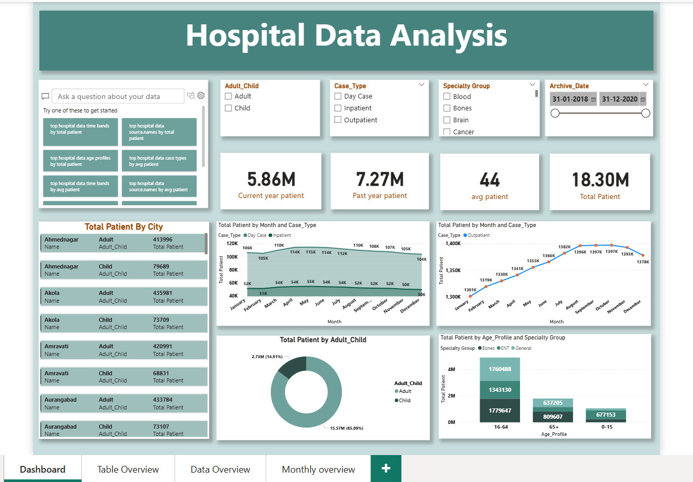
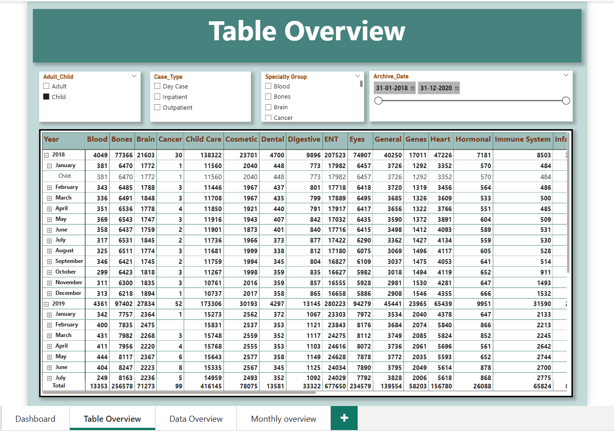
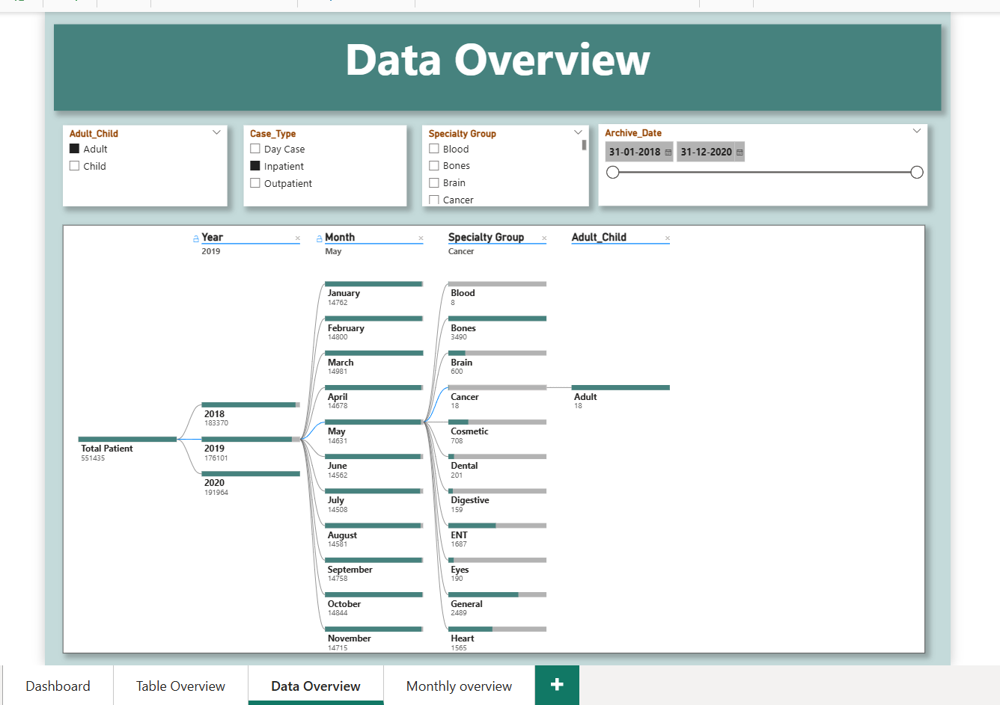
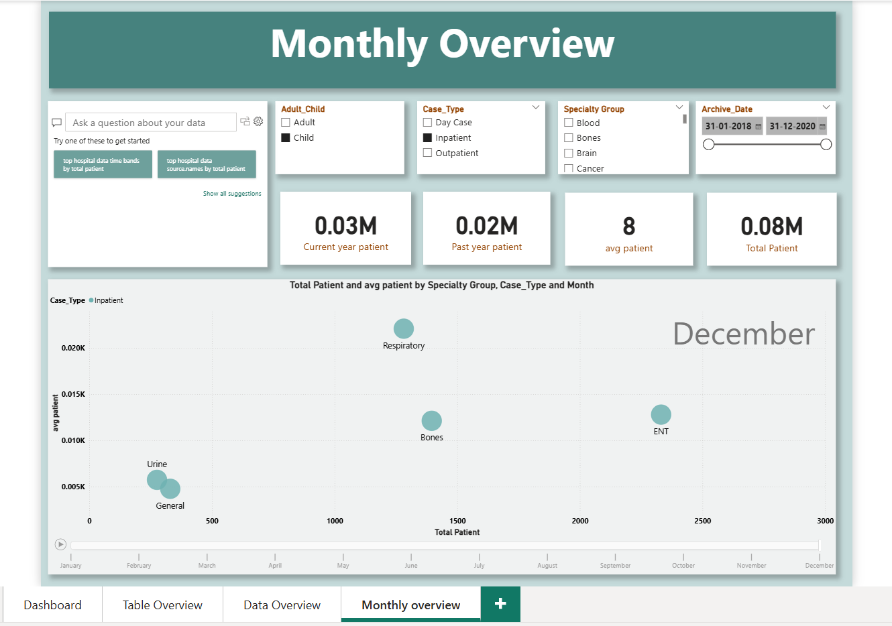

# 🏥 Hospital Data Analysis Dashboard  

## 📌 Project Overview  
This project is an **interactive Hospital Data Analysis Dashboard** built using **Power BI**.  
The dashboard provides insights into patient data across multiple dimensions such as **age group, specialty, case type, city, and time period**.  

The analysis helps in understanding:  
- Patient distribution (Adult vs Child)  
- Case type trends (Inpatient, Outpatient, Day Case)  
- Specialty group performance  
- City-wise and age-wise patient counts  
- Yearly and monthly trends  

The project uses the provided **Excel dataset (`Hospital_Data.xlsb`)** as the source, with transformations and modeling done in Power BI.  

---

## 📊 Key Features  
✅ **Patient Overview** – Total patients, current year vs past year, average patients.  
✅ **Monthly Trends** – Patient count analysis by month and case type.  
✅ **Specialty Analysis** – Distribution across specialties (e.g., Blood, Bones, Brain, Cancer, etc.).  
✅ **City-wise Analysis** – Comparison of patients across different cities.  
✅ **Age Group Insights** – Patient distribution by age profile (0–15, 16–64, 65+).  
✅ **Filters** – Interactive slicers for Year, Month, Specialty Group, Case Type, and Age Group.  

---

## 📂 Project Files  
- `Hospital Analysis.pbix` → Power BI dashboard file  
- `Hospital_Data.xlsb` → Raw dataset used for building the dashboard  
- `Dashboard_preview.png` → Dashboard main view preview  
- `Dashboard_preview1.png`, `Dashboard_preview2.png`, `Dashboard_preview3.png` → Additional screenshots of detailed pages  

---

## 📷 Dashboard Previews  

### 🔹 Main Dashboard  
  

### 🔹 Monthly Overview  
  

### 🔹 Data Overview  
  

### 🔹 Table Overview  
  

---

## 🚀 How to Use  
1. Download the repository.  
2. Open `Hospital Analysis.pbix` in **Power BI Desktop**.  
3. Load the dataset (`Hospital_Data.xlsb`) if prompted.  
4. Explore the interactive dashboard by using filters and slicers.  

---

## 🛠️ Tools & Technologies  
- **Power BI** – Data modeling & visualization  
- **Excel (`.xlsb`)** – Data source  
- **DAX** – Calculations and measures  

---

## 📈 Insights  
- The hospital handled **18.3M patients** in total.  
- Outpatient cases form the majority of visits.  
- Adult patients (16–64) make up ~86% of total patients.  
- Seasonal variations are visible, with peaks in mid-year months.  
- Specialty groups like **Bones, General, and ENT** have the highest patient counts.  

---

## 📌 Author  
👤 **Aadarsh Jaiswal**  
- 💼 Data Analyst | SQL | Power BI | Python | Excel  
- 🌐 [Portfolio](https://aadarshjaiswalvns.github.io/Data-Analytics-Portfolio)  
- 🔗 [LinkedIn](https://www.linkedin.com/in/aadarsh-jaiswal)  
- 📧 aadarshjaiswal.vns@gmail.com  
